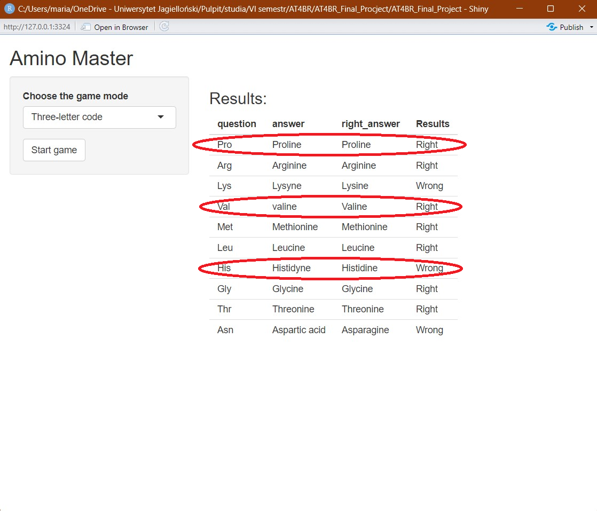

# AT4BR_Final_Project
Maria Koziarz
## "Amino Master" Game

### Introduction
The aim of this game is to help the begginiers in science,
to learn the structures and the codes of protein aminoacids.
### How to play

### References
https://shiny.posit.co/

https://stackoverflow.com/

https://app.biorender.com/

